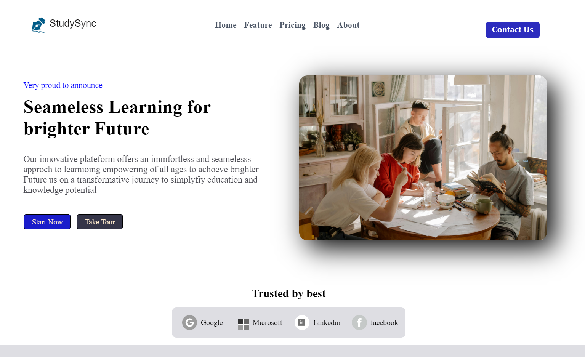

# StudySync UI Project

This project is a web-based interface for **StudySync**, designed using **HTML** and **CSS**. It provides a simple and clean UI for users to interact with educational content.

## Features

- **Responsive Design**: The UI is designed to be responsive, ensuring a seamless experience across different devices.
- **Hover Effects**: Interactive hover effects, such as scaling images, are used to enhance the user experience.
- **Modern Design**: The layout and styles follow modern design practices, making the interface visually appealing and easy to navigate.
## Screenshot

## Technologies Used

- **HTML5**: Used for structuring the content of the website.
- **CSS3**: Used for styling and layout, including the use of transitions and hover effects for interactive elements.

## Live Demo

Check out the live demo of the project here:

[Live Demo](https://study-sync-gamma.vercel.app/)

 
